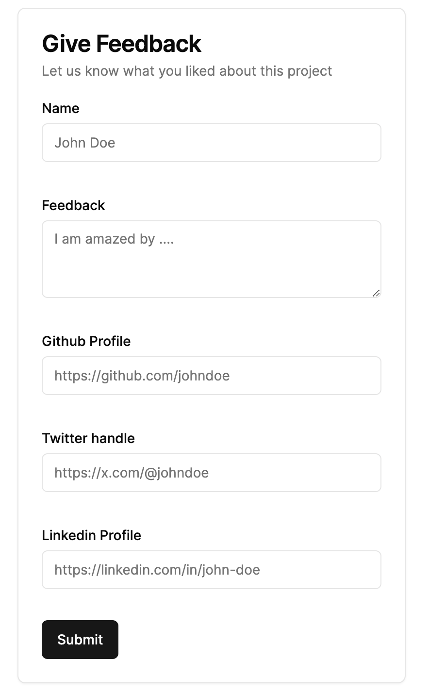

# Todo

- [x] Feedback form UI v0
- [x] Feedback form UI v1 - progressive form prototype ready
- [ ] react-hook-form + zod(client-side validation) + server actions + advanced error handling

# Refinements

## Feedback form UI v0

On second thoughts, let's make the feedback process cool and awesome.

This look like a boring health-survey form.

## Feedback form UI v1

Feed back submission process should be a progressive multi-step process

1. Step 01: Take personal details name, occupation, github url (like they show in testimonial section)
2. Step 02: Take more information twitter and linkedin
3. Step 03: Take the feedback and ask if they would like to be shown on the landing page
4. Step 04 : Show preview of how their feedback will be shown on UI
5. Step 05 : Submit form with all details

### How to implement this

Until step 04, store all the user input in local storage and once they submit in step 05 add to database finally

- The back and next button should be in parent, and the submit button inside each form component
- `formStage` and `setFormStage` props should be send to each components so that we don't need submit button from each of them (their submit button will do it for us)

# References

1. [advanced error handling](https://medium.com/@caozsn/error-handling-with-useformstate-in-nextjs-e410dbb622a9)
